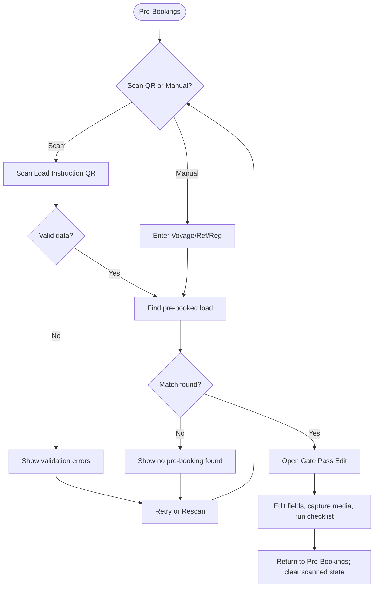
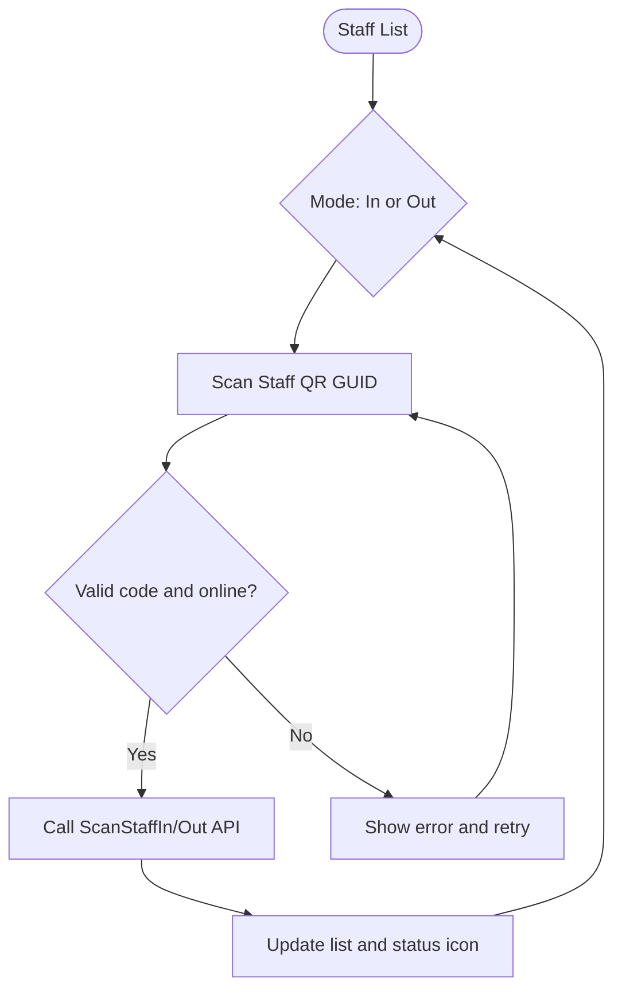
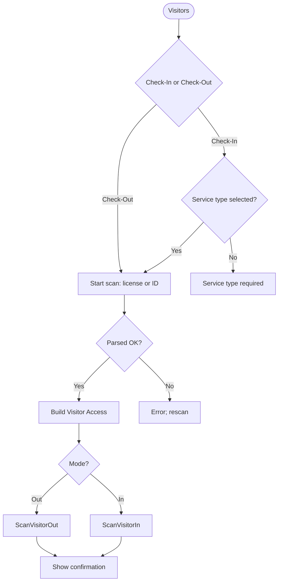
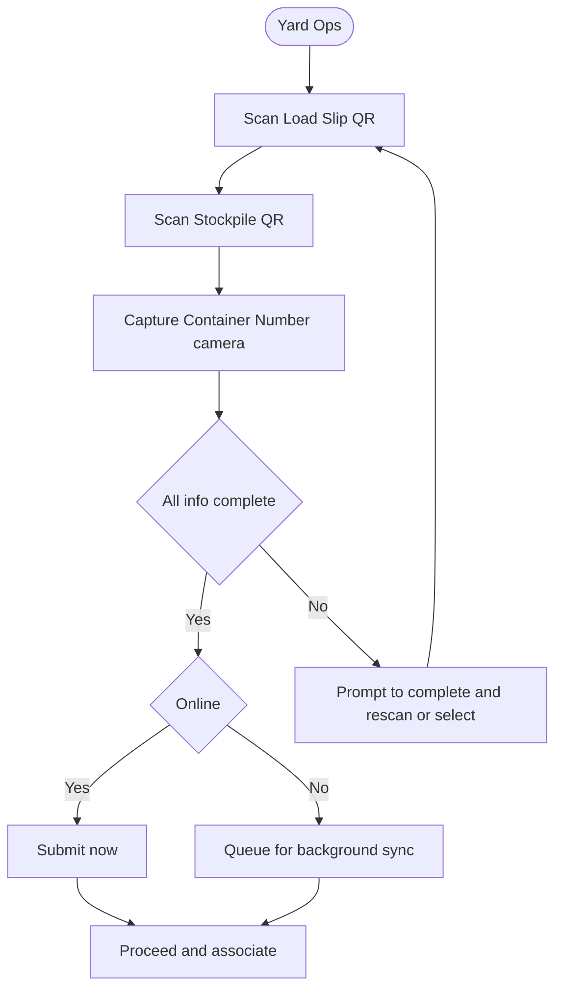
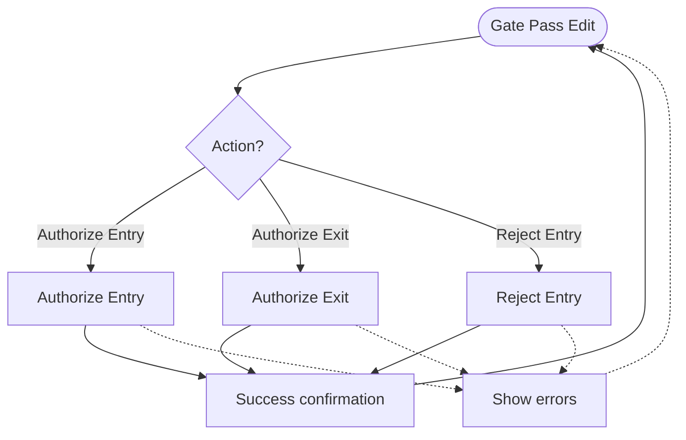
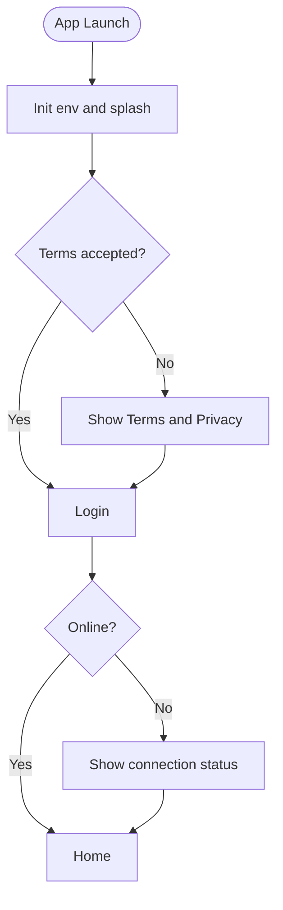
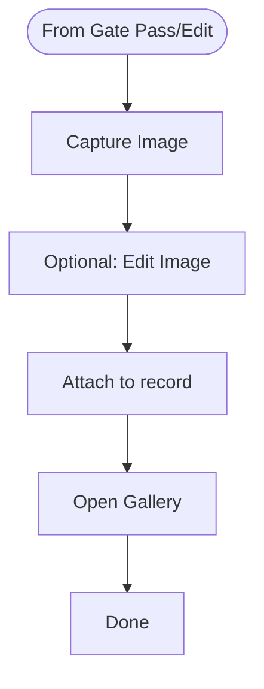
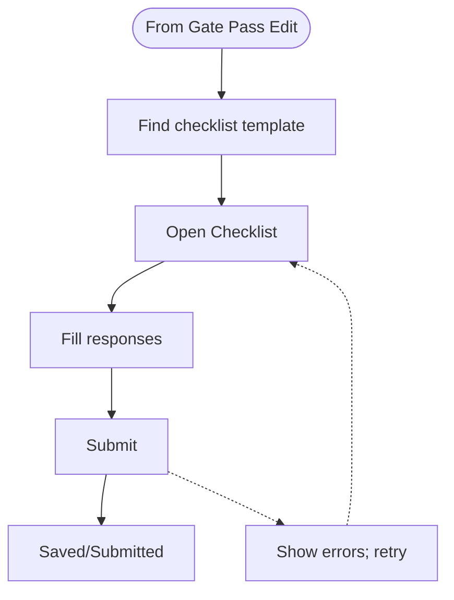

# Xstream Gatepass — Functional Specification (Summary)

This document summarizes what the application does from a user’s perspective. It focuses on capabilities and workflows, not on how they are implemented.

## Overview

The app supports gate access operations across pre-booked loads, visitor and staff access, and yard activities. It identifies people and assets using scanning, guides operators through validations and checklists, records incidents, captures media, and works in low-connectivity conditions.

Primary users: gate officers, yard operators, supervisors.

## Core capabilities

### 1. Authentication and startup

- Terms and privacy acceptance.
- User sign-in to access features.
- Startup initialization (environment, connectivity) and optional data sync.

### 2. Home and navigation

- Home dashboard as the post-login entry point.
- Gate Access Menu with quick access to:
  - Pre-Bookings
  - Visitors
  - Staff
  - Yard Operations
- Device Scan Settings screen to configure device-level scanning behavior.
- Access to account and data sync screens.

### 3. Gate Pass management

- View, create, and edit a Gate Pass record.
- Capture and maintain:
  - Driver info
  - Vehicle info
  - Trailer(s) info
  - Container info
  - Times/milestones
  - Attachments (photos/documents)
- Actions:
  - Authorize for entry
  - Authorize for exit
  - Reject entry

### 4. Scanning and identification

- Hardware-triggered barcode/QR scanning on supported devices.
- Camera-based QR/barcode capture alternative.
- Supported scan contexts include (examples):
  - Load instruction QR
  - Staff QR (GUID code)
  - Driver’s license card
  - Vehicle license disk
  - Temporary/other license formats
  - Container number (camera assist)
- Operators can switch the expected scan type per workflow.

### 5. Gate Access — Pre-Bookings

- Scan a load instruction QR or manually enter known identifiers (e.g., Voyage No, booking/order numbers, vehicle registration, references).
- Validate and find a matching pre-booked load.
- On success, open the Gate Pass edit screen pre-populated with booking data.
- Show a summary of scanned/typed values and validation errors with retry options.

### 6. Gate Access — Visitors

- Check-in and check-out visitor access at the gate.
- For check-in, select a service type when required.
- Support pre-booked visitor flows as well as ad-hoc scanning from IDs/license disks.
- Provide clear error feedback (e.g., missing connection, missing required inputs).

### 7. Gate Access — Staff

- Paged list of staff with fast search/filter.
- Toggle scan mode between “Scan Staff In” and “Scan Staff Out”.
- Scan staff QR (GUID) to perform check-in/out and refresh the list state.
- Option to find by a QR code value manually.

### 8. Yard operations

- Capture a Load Slip QR with fields such as Voyage No, Customer Ref No, and Load Item Code.
- Capture a Stockpile QR and select a stockpile where applicable.
- Capture or read a Container Number using a camera-assisted flow.
- Combine these pieces to progress yard workflows and show live summaries.

### 9. Checklists and incidents

- Retrieve a relevant checklist template for a given Gate Pass context (booking/delivery type, template id, etc.).
- Fill out and submit checklist responses.
- Create and review incidents linked to operations.

### 10. Media capture and viewing

- Capture images, optionally open an editor to annotate/crop.
- View images as a gallery attached to records.

### 11. Localization and permissions

- Use localized labels and values throughout the UI.
- Role/permission gating for visibility and access to:
  - Pre-Bookings
  - Visitors (Scan, Check-In, Check-Out, Pre-Book Check-In)
  - Staff (Scan, Check-In, Check-Out, Pre-Book Check-In)
  - Yard Operations
  - General Gate Access operations

### 12. Connectivity and offline resilience

- Detect connectivity and present user feedback when offline.
- Queue operations (e.g., uploads/updates) for background processing; send automatically when the connection resumes.

### 13. Notifications and overlays

- In-app prompts, confirmations, and error alerts via dialogs/overlays and bottom sheets.

## Key workflows (contracts)

### A. Pre-booking → Gate Pass edit

- Inputs: Load instruction QR or manual identifiers (e.g., Voyage No, order/booking numbers, vehicle reg).
- Process: Parse and validate → search for pre-booking → on success open Gate Pass edit → on return clear temporary scanned state.
- Success: Matching pre-booking found and editable Gate Pass displayed.
- Errors: Invalid QR; no booking found; network issues; show actionable messages.

### B. Staff check-in/out

- Inputs: Staff QR (GUID); operator sets mode (In/Out).
- Process: Submit check-in/out; update the paged list and show per-staff status.
- Success: Staff entry/exit recorded; list reflects current state.
- Errors: Invalid/unknown code; network issues; provide retry.

### C. Visitor check-in/out

- Inputs: ID/license scan (or pre-booked visitor reference); service type for check-in where required.
- Process: Parse ID/scan → build visitor access model → submit check-in/out.
- Success: Visitor entry/exit recorded; confirmation shown.
- Errors: Missing service type; invalid scan; offline.

### D. Yard ops association

- Inputs: Load Slip QR, Stockpile QR, optional Container No (camera reader).
- Process: Capture all, validate completeness, present summaries.
- Success: Valid association set; proceed to next operational step.
- Errors: Partial/invalid scans; offline.

## Visual process flows

> Note: These diagrams use Mermaid. They render on GitHub and in VS Code’s Markdown preview (with Mermaid support).

### A. Pre-booking → Gate Pass edit (flow)

### B. Staff check-in/out (flow)

### C. Visitor check-in/out (flow)

### D. Yard operations association (flow)

### E. Gate Pass management actions (flow)

### F. Startup and login (flow)

### G. Media capture and viewing (flow)

### H. Checklist flow

## Navigation map (screens)

- Startup → Login → Home → Gate Access Menu
- Gate Access Pre-Booking → Gate Pass Edit
- Gate Access Staff List
- Gate Access Visitors List (with a scan bottom sheet)
- Yard Ops → Yard Ops Select → Container No Reader (camera)
- Camera capture / Barcode reader / Image editor / Image gallery
- Device Scan Settings
- Checklists
- Data Sync and Account areas

## Edge cases to expect

- Offline or unstable network during scans and submissions.
- Scans producing malformed or incomplete data.
- Duplicate scans while a submission is in progress.
- Missing required fields (e.g., service type) before action.
- Insufficient permissions for a requested view/action.

---

